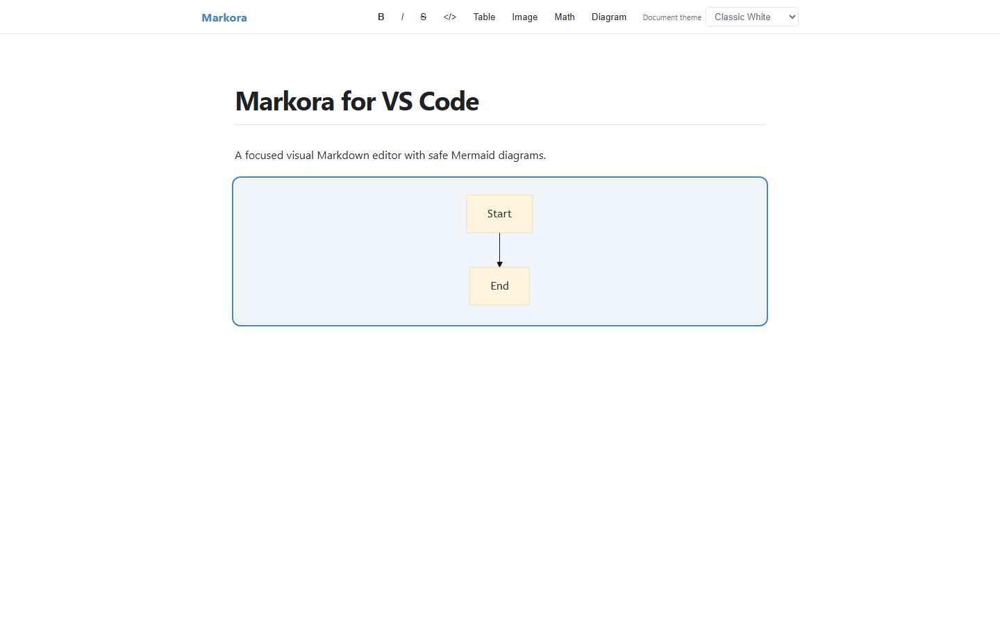

# Markora - Visual Markdown Editor for VS Code

[](https://marketplace.visualstudio.com/items?itemName=MohamedAzzimJ.markora-markdown-editor)
[](https://marketplace.visualstudio.com/items?itemName=MohamedAzzimJ.markora-markdown-editor)
[](https://github.com/mohamedazzim/markora-vscode/releases)
[](https://github.com/mohamedazzim/markora-vscode/actions/workflows/ci.yml)
[](https://github.com/mohamedazzim/markora-vscode/actions/workflows/codeql.yml)
[](LICENSE)

An open-source visual Markdown editor for Visual Studio Code. Markora provides a focused, Typora-inspired
writing surface inside VS Code while keeping VS Code's `TextDocument` authoritative for saving, undo, redo,
source control, hot exit, diffing, remote workspaces, and file watching.



The public Marketplace listing is **0.1.2**. The current GitHub security patch release is **0.1.3**;
Marketplace publication of 0.1.3 is pending publisher authentication and is not claimed here.

## Features

- Reopen `.md`, `.markdown`, `.mdown`, and `.mkd` files with **Markora Visual Editor**.
- Structured editing for headings, paragraphs, emphasis, links, images, lists, tasks, quotes, code, tables,
  math blocks, Mermaid fences, and horizontal rules.
- Native VS Code Source Mode through **Markora: Open Source Editor**.
- Document themes: **Classic White (the default)**, Paper, Academic, Sepia, Graphite, Midnight, High Contrast,
  or follow VS Code.
- Offline core editing, strict webview CSP, validated messages, sanitized HTML, and no telemetry by default.
- Reversible Markdown round trips; unsupported constructs remain available in Source Mode.

## Install

Install the current published extension directly from the Marketplace:

```powershell
code --install-extension MohamedAzzimJ.markora-markdown-editor
```

Or download and install the verified public `0.1.3` VSIX:

```powershell
Invoke-WebRequest `
  -Uri "https://github.com/mohamedazzim/markora-vscode/releases/download/v0.1.3/markora-markdown-editor-0.1.3.vsix" `
  -OutFile ".\markora-markdown-editor-0.1.3.vsix"
code --install-extension .\markora-markdown-editor-0.1.3.vsix
```

The matching [SHA-256SUMS.txt](https://github.com/mohamedazzim/markora-vscode/releases/download/v0.1.3/SHA256SUMS.txt)
is attached to the release. Open a Markdown file, right-click its tab, choose **Reopen Editor With...**, then
select **Markora Visual Editor**. Choose **Configure Default Editor for...** in that picker if you want it as
the default later.

## Public links

- [Visual Studio Marketplace](https://marketplace.visualstudio.com/items?itemName=MohamedAzzimJ.markora-markdown-editor)
- [GitHub repository](https://github.com/mohamedazzim/markora-vscode)
- [GitHub releases](https://github.com/mohamedazzim/markora-vscode/releases)
- [Issues](https://github.com/mohamedazzim/markora-vscode/issues)
- [Security reporting](https://github.com/mohamedazzim/markora-vscode/security/advisories/new)
- [Desktop Markora](https://github.com/mohamedazzim/markora-desktop)

## Commands

Use the Command Palette (`Ctrl+Shift+P`) and search for `Markora`. Commands include Open Visual Editor,
Open Source Editor, Toggle Visual/Source Editor, Insert Table, Insert Image, Insert Math, Insert Mermaid Diagram,
Copy as HTML, Copy as Markdown, Open Theme Picker, and Show Document Outline.

## Supported Markdown

The shared core covers CommonMark/GFM, front matter, tables, task lists, fenced code, images, links, footnotes,
math delimiters, Mermaid fences, Unicode, emoji, CRLF/LF, and safe HTML. See
[Markdown support](docs/MARKDOWN_SUPPORT.md) and [normalization](docs/MARKDOWN_NORMALIZATION.md).

## Security and privacy

The extension does not collect document content or telemetry by default. Webviews use a per-load nonce CSP,
restricted local resource roots, runtime-validated message envelopes, safe external URL checks, and sanitized
HTML. Remote images are disabled by default. See [SECURITY.md](SECURITY.md) and [PRIVACY.md](PRIVACY.md).

## Development

```powershell
npm ci
npm run verify
npm run package:vsix
```

The desktop Electron application is a separate repository and is not a dependency of this extension. See
[the desktop reuse audit](docs/DESKTOP_CODE_REUSE_AUDIT.md), [architecture](docs/ARCHITECTURE.md), and
[contribution guide](CONTRIBUTING.md).

## Marketplace presentation

The Marketplace listing currently exposes the original Markora icon, README, MIT license, changelog,
repository and issue links at version 0.1.2. This GitHub README intentionally has no embedded logo image;
the icon continues to be provided by extension manifest metadata. The repository screenshot is public-safe,
but no Marketplace screenshot gallery is claimed until a future authenticated publication updates its gallery.

## Limitations

PDF export is intentionally not bundled. Large documents can be opened in the native Source Editor. Remote
image download and some virtual-workspace operations remain restricted by workspace trust. The 0.1.3 GitHub
security release is available; Marketplace publication is pending valid publisher-owned `vsce` authentication.

## License

MIT. Third-party notices are in [THIRD_PARTY_NOTICES.md](THIRD_PARTY_NOTICES.md).
